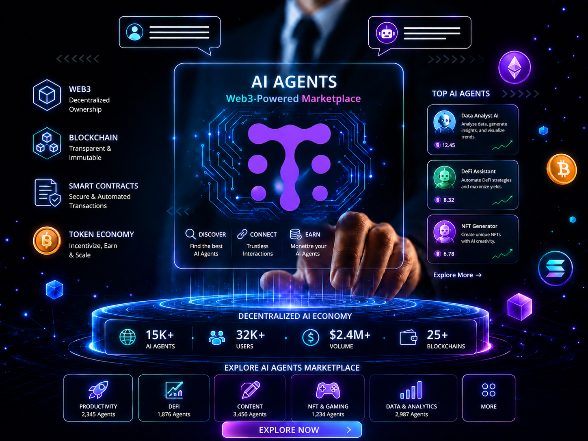

# AgentMesh - TARS AI

## Web3 AI Agent Platform & Decentralized MarketPlace

> AgentMesh is a Web3-native AI Agent Platform that enables developers to build, deploy, discover, and monetize AI agents using decentralized GPU infrastructure.
The platform combines artificial intelligence, blockchain technology, and decentralized computing into a unified ecosystem where AI agents become programmable digital services that can be securely deployed, integrated, and commercialized.
AgentMesh removes the complexity of managing GPU infrastructure, deployment pipelines, API hosting, and scalability, allowing developers to focus on building intelligent applications while providing businesses with production-ready AI services through a secure marketplace.
Whether you're developing AI assistants, blockchain automation tools, trading agents, research assistants, enterprise workflows, or gaming agents, AgentMesh provides the infrastructure needed to launch and scale AI applications within the Web3 ecosystem.

---

<p align="center">
  
</p>

---
## Key Features

- **AI Agent Marketplace**: Discover, publish, and manage AI agents through a unified marketplace.
- **AI Agent Deployment**: Deploy AI agents with a streamlined deployment workflow.
- **Decentralized GPU Runtime**: Execute AI workloads using decentralized GPU infrastructure.
- **Web3 Authentication**: Authenticate users through blockchain wallets.
- **AI Agent Monetization**: Allow developers to generate revenue from their AI applications.
- **API Gateway**: Automatically expose secure APIs for every deployed AI agent.
- **Developer Dashboard**: Manage AI agents from a centralized workspace.
- **Analytics**: Monitor AI agent performance in real time.
- **Blockchain Integration**: Blockchain powers the Web3 layer of AgentMesh.

> AI inference runs on decentralized GPU infrastructure, while blockchain provides ownership, authentication, payments, and transparency.

---

## Coming Soon

- AI Agent SDK
- AgentMesh CLI
-AI Agent Templates
- AI Workflow Builder
- Team Workspaces
- Enterprise Organizations
- Agent-to-Agent Communication
- AI Plugin Marketplace
- AI Model Registry
- Multi-Agent Orchestration
- Community Ratings & Reviews
- Crypto Payment Gateway
- Revenue Sharing Automation
- Staking & Governance
- Cross-chain Support
- Public REST API
- GraphQL API
- Developer Portal

--- 

[](#)
[](#)
[](#)
[](#)
[](#)
[](#)
[](#)
[](#)

## Quick Start

```bash
git clone <git-repository-url>
cd <Project Directory>

# Install root dependencies
npm install
npm start

# Open new Terminal | Go to the client folder and install its dependencies
cd frontend
npm install

# Start
npm start
```

---

## Config

- **JWT issuance** – `POST /api/auth` in `controllers/auth.js` signs a JWT with `config.JWT_SECRET_KEY` (see `SESSION_EXPIRES_IN`). The payload only contains `user.id` so you can safely extend it.
- **Client storage** – Tokens are pushed into Axios’ default headers via `client/src/helpers/setAuthToken.js`. Persist them in `localStorage`/`sessionStorage` from your auth screen and call `setAuthToken(token)` on boot.
- **Protected routes** – `middleware/auth.js` expects the token in the `x-auth-token` header and injects `req.user`. Use the middleware on any route that needs authenticated identity.

## License

This project is currently under active development.

License information will be published before the first public release.


